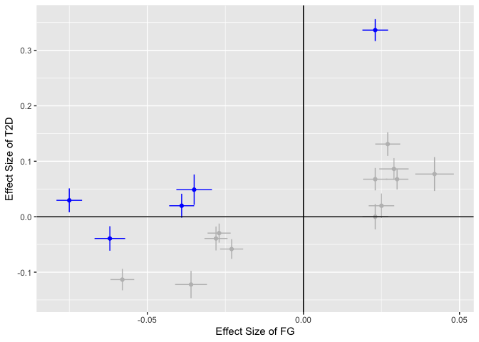

<!-- README.md is generated from README.Rmd. Please edit that file -->

# MRcML

<!-- badges: start -->

<!-- badges: end -->

R package for Mendelian randomization with constraind maximum likelihood
(MRcML) methods. Please see draft of the paper and supplementary in the
folder **Draft**
above.

## Installation

<!-- You can install the released version of MRcML from [CRAN](https://CRAN.R-project.org) with:

``` r
install.packages("MRcML")
```
-->

Install the package from [GitHub](https://github.com/) with:

``` r
# install.packages("devtools")
devtools::install_github("xue-hr/MRcML")
```

## Example

Here is an example which shows how to apply MRcML methods to make
inference about the causal effect from **Fast Glucose (FG)** to **Type-2
Diabetes (T2D)**.

``` r
library(MRcML)
summary(T2D_FG)
#>        Length Class  Mode   
#> b_exp  17     -none- numeric
#> b_out  17     -none- numeric
#> se_exp 17     -none- numeric
#> se_out 17     -none- numeric
```

Example data `T2D_FG` is a list which contains estimated effects sizes
and standard errors of 17 SNPs on T2D and FG. Now we perfrom the main
function with sample size of FG which is 46186, and using 100 random
start points. We set the random seed `random_seed = 1` to make sure
results are replicable.

``` r
cML_result = mr_cML(T2D_FG$b_exp,
                    T2D_FG$b_out,
                    T2D_FG$se_exp,
                    T2D_FG$se_out,
                    n = 46186,
                    random_start = 100,
                    random_seed = 1)
#> Warning in cML_estimate_random(b_exp = b_exp, b_out = b_out, se_exp = se_exp, :
#> May not converge to minimums with some given start points and maximum number of
#> iteration, lead to Fisher Information matrices not positive definite. Could try
#> increasing number of iterations (maxit) or try different start points. Note:
#> If multiple random start points are used, this warning does not likely affect
#> result.
```

We get a warning message from the function `cML_estimate_random()`. The
reason is: here we use 100 random starting points to minimize the
non-convex loss function, some of them may not converge to a local
minimum and result in Fisher Information matrices that are not positive
definite. It is not likely affecting the optimization result, since in
the end we only use the start point gives the minimum loss and discard
all other start points including those do not converge. Now lets take a
look at the results:

``` r
cML_result
#> $MA_BIC_theta
#> [1] 2.110808
#> 
#> $MA_BIC_se
#> [1] 0.2455809
#> 
#> $MA_BIC_p
#> [1] 8.314666e-18
#> 
#> $BIC_theta
#> [1] 2.236579
#> 
#> $BIC_se
#> [1] 0.2061844
#> 
#> $BIC_p
#> [1] 2.050249e-27
#> 
#> $BIC_invalid
#> [1]  8 12 13 15 17
#> 
#> $MA_AIC_theta
#> [1] 2.09175
#> 
#> $MA_AIC_se
#> [1] 0.3012363
#> 
#> $MA_AIC_p
#> [1] 3.814609e-12
#> 
#> $AIC_theta
#> [1] 1.996619
#> 
#> $AIC_se
#> [1] 0.2194686
#> 
#> $AIC_p
#> [1] 9.242142e-20
#> 
#> $AIC_invalid
#> [1]  1  5  8 12 13 14 15 17
```

BIC selected model gives us indices of invalid IVs: 8, 12, 13, 15, 17.
Now lets draw the scatter plot, invalid IVs are marked with blue:



Now let us perform cML with data perturbation. The default number of
perturbations is 200, and we use 10 random start points. In real
application, we recommend use more random start points to get reliable
results even it takes more time, like 10 or even 100; in simulations the
number of random start points could be set to 0 (i.e. do not use random
start) to speed up.

``` r
cML_result_DP = mr_cML_DP(T2D_FG$b_exp,
                          T2D_FG$b_out,
                          T2D_FG$se_exp,
                          T2D_FG$se_out,
                          n = 46186,
                          random_start = 10,
                          random_start_pert = 10,
                          random_seed = 1,
                          num_pert = 200)
```

Results with data perturbation:

``` r
cML_result_DP
#> $MA_BIC_theta
#> [1] 2.110809
#> 
#> $MA_BIC_se
#> [1] 0.2455808
#> 
#> $MA_BIC_p
#> [1] 8.313889e-18
#> 
#> $BIC_theta
#> [1] 2.236579
#> 
#> $BIC_se
#> [1] 0.2061844
#> 
#> $BIC_p
#> [1] 2.050249e-27
#> 
#> $BIC_invalid
#> [1]  8 12 13 15 17
#> 
#> $MA_BIC_DP_theta
#> [1] 1.895029
#> 
#> $MA_BIC_DP_se
#> [1] 0.5151985
#> 
#> $MA_BIC_DP_p
#> [1] 0.0002348404
#> 
#> $BIC_DP_theta
#> [1] 1.884913
#> 
#> $BIC_DP_se
#> [1] 0.5313405
#> 
#> $BIC_DP_p
#> [1] 0.0003889549
#> 
#> $GOF1_p
#> [1] 4.046025e-12
#> 
#> $GOF2_p
#> [1] 2.204418e-16
```

<!-- You'll still need to render `README.Rmd` regularly, to keep `README.md` up-to-date.

You can also embed plots, for example:


In that case, don't forget to commit and push the resulting figure files, so they display on GitHub! -->
